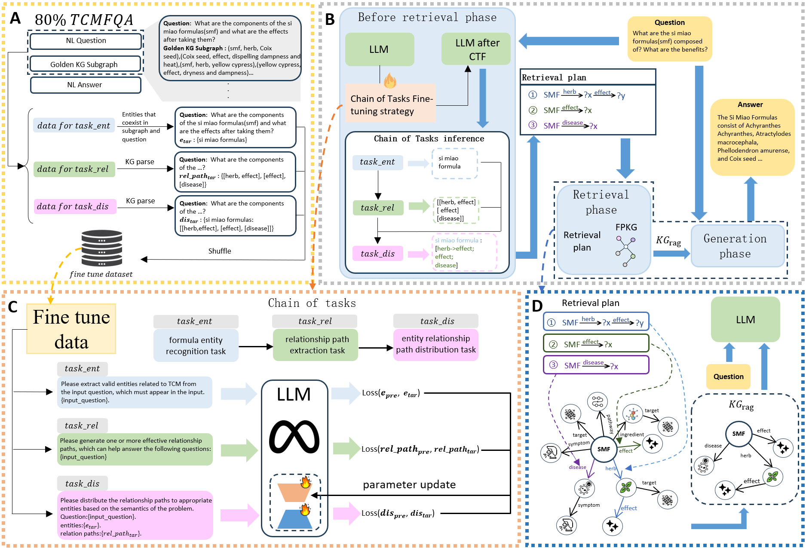
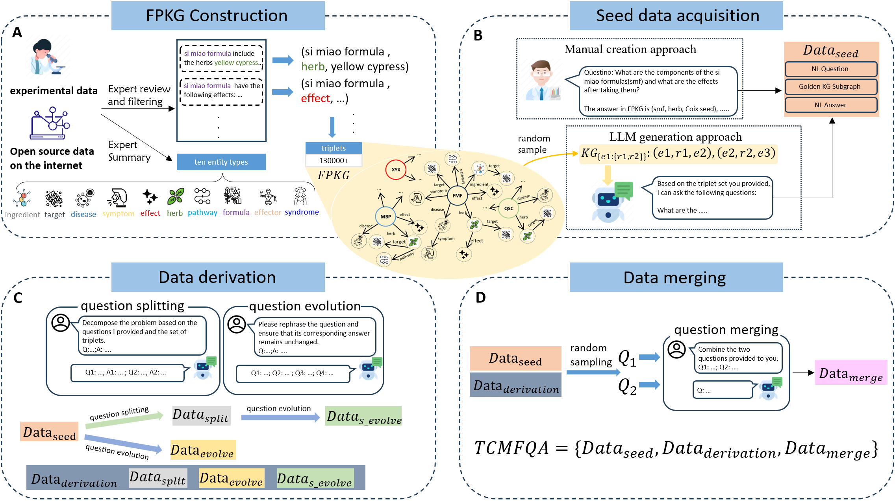
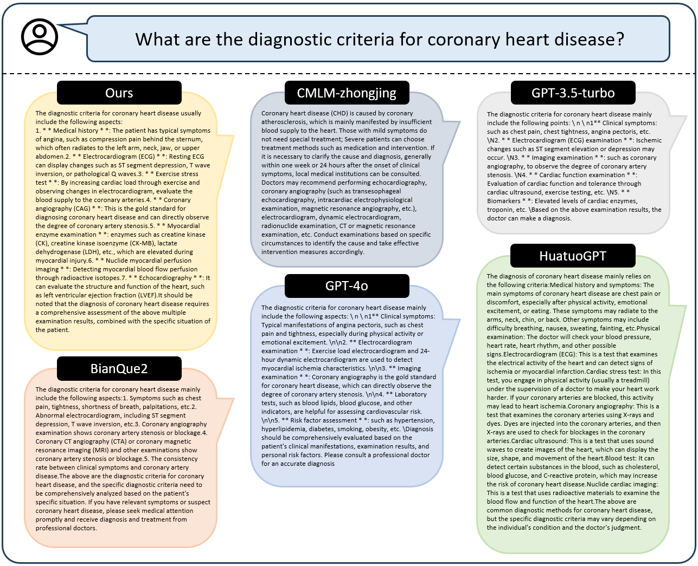

# LarKnow
LarKnow: a Large Language Model Improved Architecture based on Knowledge Graph Augmentation for Mechanism Interpretation of Traditional Chinese Medicine formulas

# introduction

Traditional Chinese Medicine formulas (TCMFs) play vital roles in chronic diseases due to their flexible herb compatibility and component synergy. However, the com- plexity of their numerous components and intricate interactions presents significant challenges for their mechanistic exploration. Here, we provided LarKnow, a large language model (LLM) improved architecture based on knowledge graph augmen- tation for mechanism interpretation of TCMFs. In detail, we first constructed a pharmacological knowledge graph of TCMFs (FPKG) and then generated a domain- specific question and answer dataset (TCMFQA), which was delivered to base large language models as fine-tuning materials to alleviate hallucination of these models. Notably, we proposed chain of task fine-tuning (CTF), a hybrid strategy combining chain of thought (CoT) and multi task fine-tuning (MTF). In practice, the FPKG was connected to base LLMs through the GraphRAG technology, where the CTF strat- egy was applied to guide LLMs to generate more precise and prescriptive answers for mechanistic questions of TCMFs. We validated the effectiveness of LarKnow through combining the architecture with various LLMs and comparing their per- formance with baseline models. Comparison results showed that LLMs embedded LarKnow achieved the SOTA performance in multiple tasks when compared with baseline models. Finally, the practical capability of LarKnow was evaluated through mechanism questioning and answering for TCMFs against coronary heart disease. In a nutshell, LarKnow is a novel LLM enhance architecture based on domain knowledge graph, advancing pharmacological investigation of TCMFs.

# model_pipline

The overall framework of chain of tasks fine-tuning (CTF) strategy and the LLM with LarKnow. (a) Fine tuning data preparation. The fine-tuning dataset consists of 80% of the TCM- FQA dataset. After parsing the golden subgraph of each data in TCMFQA, the fine-tuning data corresponding to three sub tasks are obtained. After collecting and shuffling all the data, the task chain fine-tuning dataset was obtained. (b) Overall Framework Of Larknow. The inference process could be divided into before retrieval stage, retrieval stage, and generation stage. In the before re- trieval stage, LLM with LarKnow carried out the chain of tasks and obtained the knowledge graph retrieval plan. Then enter the retrieval phase to retrieve subgraphs, and in the final generation phase Larknow answers the question. (c) Chain of Tasks Fine-tuning strategy. LLM simultane- ously learns three sub tasks on the task chain. Each subtask corresponds to a different loss, and the model parameters are updated together. (d) Retrieval & Generation phase. During the retrieval phase, Larknow first locates entities based on the retrieval plan, and then conducts searches on a relational basis. After organizing the retrieved subgraphs,  they are input into LLM along with the question during the generation phase for answering.

# data_construction

 TCMFQA construction process. Before building the TCMFQA, we first need to construct FPKG (as shown in Figure). We first collected open-source data and expert experimental data, and after cleaning and organizing, we divided the entities into ten categories. We take the category of the tail entities of two related entities as their relationship (using ’herb’ and ’effect’ as examples in the figure), resulting in over 130000 triplets. The entire TCMFQA construction process mainly consists of three stages: seed data acquisition, data derivation, and data merging.

# case_study

Continuously updating......
